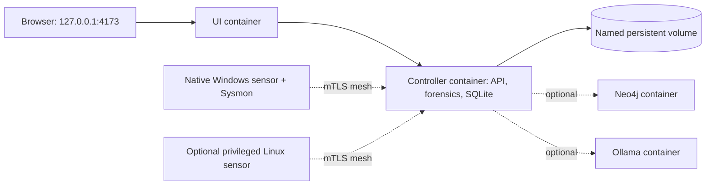

# Containers

WatchTower has a Docker Compose deployment for a reproducible **controller and
UI**. It is deliberately hybrid: the controller runs offline analysis, storage,
the API, evidence processing, AI orchestration, and optional mesh control;
native Windows capture and Sysmon remain native host functions. Linux capture
is available only through the explicit `linux-sensor` profile.



The Compose file publishes **only** the UI on loopback. The controller API is
internal to the Compose network. It is not a remote multi-user deployment and
does not replace the native installer for Windows packet capture or Sysmon.

## Quick start

Install and start Docker Desktop, clone the repository, then run one command
to create local configuration and the installation key:

```powershell
.\scripts\container.ps1 init
.\scripts\container.ps1 up
.\scripts\container.ps1 status
```

On Linux:

```bash
bash scripts/container.sh init
bash scripts/container.sh up
bash scripts/container.sh status
```

Open `http://127.0.0.1:4173`. First-run operator authentication remains active
inside the container deployment. The generated `deploy/container/.env.container`
and `deploy/container/secrets/` directory are local-only and ignored by Git.

Use `logs` when a service does not become healthy, and `down` to stop it while
retaining data:

```text
scripts/container.ps1 logs
scripts/container.ps1 down
```

`reset` removes named volumes and therefore permanently removes container-held
WatchTower data. It does not remove native host state.

## Windows hybrid runtime

For a Windows workstation, use the hybrid scripts instead of manually joining
the host sensor to the Compose controller. The installer is idempotent: it
builds the native Rust sensor if necessary, initializes the private sensor
runtime, creates the container key, and builds the controller/UI images.

```powershell
Set-ExecutionPolicy -Scope Process Bypass
.\install.ps1
```

`-InstallPrerequisites` can install missing Python, Rust, C++ build tools, and
Docker Desktop through `winget`. Npcap opens its official installer and must be
accepted interactively. Start Docker Desktop once after it is installed, then
rerun the command if requested. Add `-WithSysmon` only when Sysmon is already
installed; pass `-SysmonExecutable C:\Tools\Sysmon64.exe` when it is not on
`PATH`.

Start the complete local stack with one command:

```powershell
.\watchtower.ps1 start
```

The runtime starts the Compose controller/UI, configures its mesh listener on
`127.0.0.1:9443/9444`, creates a short-lived one-time enrollment package inside
the controller, enrolls the native sensor over mTLS, and starts bounded
telemetry forwarding. It then opens the browser UI and a companion
controller-backed `tower` command window. Select and start an interface in
either surface; WatchTower never begins capture merely because the runtime
started.

```powershell
.\watchtower.ps1 status
.\watchtower.ps1 stop
.\watchtower.ps1 restart
.\watchtower.ps1 repair
```

`repair` removes and recreates only the host sensor enrollment; it does not
clear controller evidence, Docker volumes, captures, or application settings.
The native sensor uses `%LOCALAPPDATA%\WatchTower\hybrid-sensor`; the browser
continues to use the controller's normal first-run authentication at
`http://127.0.0.1:4173`.

The companion CLI runs inside the controller container, so `flows`, `alerts`,
`dive`, `lookup`, and `hunt` use the same controller evidence as the UI. Its
`start`, `stop`, `sources`, and `status` commands are routed to the enrolled
native sensor. UI and CLI share the same eight-hour controller session; unlock
or lock either one and the other reflects that state automatically.

The automatic bridge is intentionally **local only**. It publishes mesh ports
only on loopback and transfers metadata, findings, endpoint attribution, and
health records. Raw PCAPs, artifacts, and evidence excerpts stay on the host
unless the operator explicitly exports a case. Use the manual VPN-overlay mesh
workflow below for another device.

The hybrid installer builds images once. `run-hybrid.ps1 start` reuses them for
fast normal startup. Run `scripts/container.ps1 build -WithMesh` after pulling
source changes, then restart the hybrid runtime.

## Persistent data and credentials

The named `watchtower-state` volume holds SQLite state, cases, exports, config,
and the encrypted credential vault. The Compose wrapper creates a random
32-byte installation key at `deploy/container/secrets/watchtower_master_key`.
Docker mounts that key as a file at runtime; it is not an environment variable,
database field, or image layer. Losing the key makes encrypted provider and
evidence keys unreadable, so back up the state volume and the installation key
together using your normal encrypted backup process.

OpenAI credentials are added through the Settings UI or the controller CLI and
are encrypted in that vault. Local Ollama needs no provider credential.

## Optional services

Start local Ollama alongside the controller:

```powershell
.\scripts\container.ps1 up -WithOllama
```

Start the Neo4j evidence projection:

```powershell
.\scripts\container.ps1 up -WithNeo4j
```

The wrapper generates a separate Neo4j password secret. Neo4j remains internal
to Compose; WatchTower connects to it by service name and SQLite remains the
source of truth.

For remote mesh nodes, prefer a VPN-overlay address. Set
`WATCHTOWER_MESH_BIND_ADDRESS` in `deploy/container/.env.container`, then use:

```powershell
.\scripts\container.ps1 up -WithMesh
```

This intentionally publishes only mesh enrollment and ingestion ports. Use the
WatchTower mesh wizard to configure the advertised VPN address and issue join
packages. Do not use an unprotected public address.

The `linux-sensor` profile is for a Linux host only. Set
`WATCHTOWER_SENSOR_INTERFACE` in the local container environment and start it
with `-LinuxSensor`. It uses host networking and only `NET_RAW` and `NET_ADMIN`;
it does not run privileged and it is never enabled by default. Windows capture,
Bluetooth capture, and Sysmon are native-host capabilities.

## Registry images

The CI workflow builds `controller` and `ui` images for `linux/amd64` and can
publish them to GHCR on version tags. A release operator can set
`WATCHTOWER_CONTROLLER_IMAGE` and `WATCHTOWER_UI_IMAGE` in the container env
file to use approved registry images instead of local builds. Build provenance
and SBOM attestations are produced by the release workflow.
